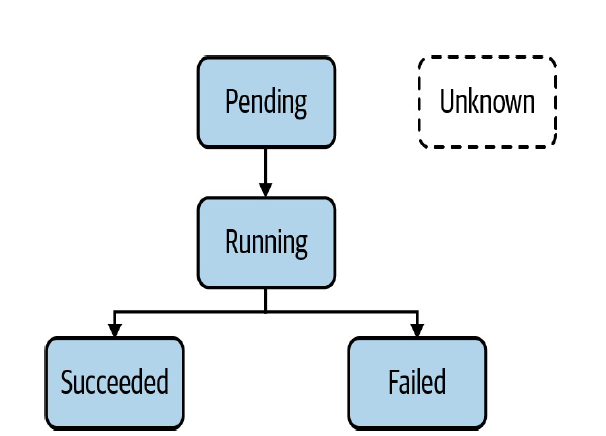
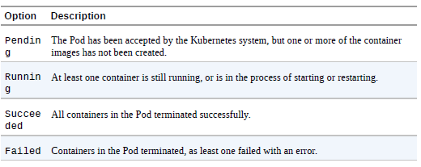

# POD
```
kubectl run hazelcast --image=hazelcast/hazelcast --restart=Never \
--port=5701 --env="DNS_DOMAIN=cluster" --
labels="app=hazelcast,env=prod"
```
There are some parameters important in run command

|Option  	|Example Value   	|Description   	|
|---	    |---	            |---	|
|--image   	|nginx    	        |   	|
|--port   	|8080   	        |   	|
|--rm   	|-   	            |deletes pod after the command in the container finishes   	|
|--env   	|PROFILE=dev   	    |   	|
|--labels   |app=frontend   	|   	|

Equvailent YAML file
```
apiVersion: v1
kind: Pod
  metadata:
    name: hazelcast
    labels:
      app: hazelcast
      env: prod
spec:
  containers:
    - env:
    - name: DNS_DOMAIN
      value: cluster
    image: hazelcast/hazelcast
    name: hazelcast
    ports:
      - containerPort: 5701
    restartPolicy: Never
```

## Pod LifeCycle
Understanding the implications of each phase is important as it gives you an idea
about the operational status of a Pod. For example, during the exam you may be
asked to identify a Pod with an issue and further debug the object



## Accessing Logs
Dont have provide resource type, works only with pod.
```
kubectl logs hazelcast
```

## Execute Command in Container
Dont have provide resource type, works only with pod.
```
kubectl exec -it hazelcast -- /bin/sh
```
The two dashes (--) separate the exec command and its
options from the command you want to run inside of the container.
<p>
It’s also possible to just execute a single command inside of a container. Say you
wanted to render the environment variables available to containers without
having to be logged in. Just remove the interactive flag -it and provide the
relevant command after the two dashes:
```
kubectl exec hazelcast -- env
```

## Declaring Environment Variable
Defining environment variables in a Pod YAML manifest is relatively easy. Add
or enhance the section env of a container. Every environment variable consists
of a key-value pair, represented by the attributes name and value. Kubernetes
does not enforce or sanitize typical naming conventions for environment variable
keys. It’s recommended to follow the standard of using upper-case letters and the
underscore character (_) to separate words.

```
apiVersion: v1
kind: Pod
metadata:
  name: spring-boot-app
spec:
  containers:
    - image: bmuschko/spring-boot-app:1.5.3
    name: spring-boot-app
    env:
    - name: SPRING_PROFILES_ACTIVE
      value: prod
    - name: VERSION
      value: '1.5.3'
```