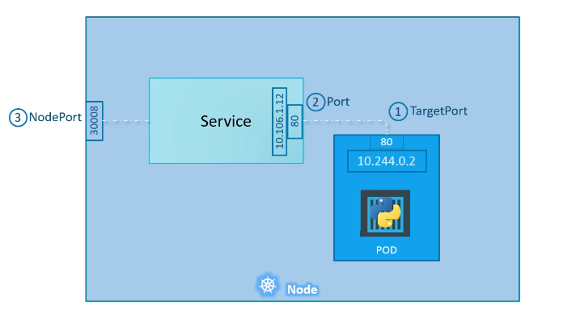
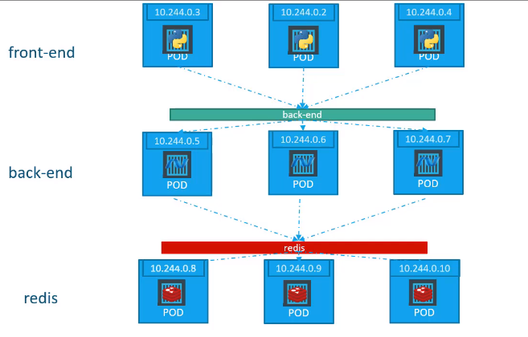
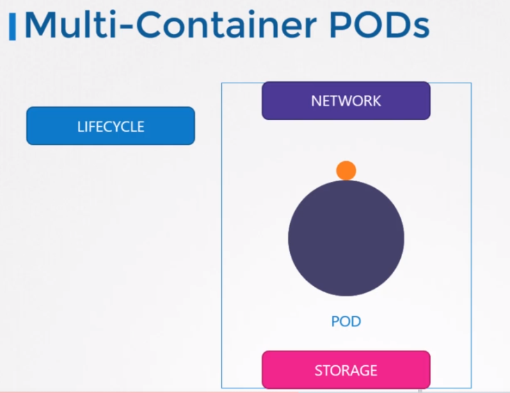
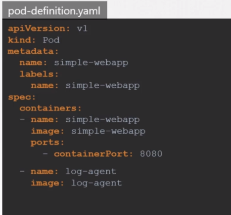
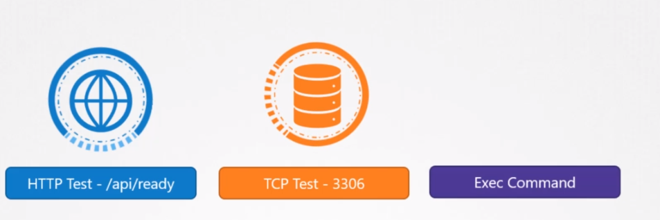
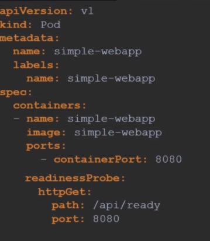
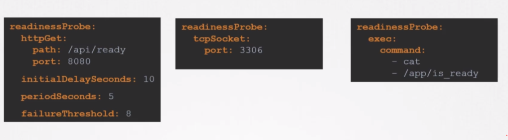
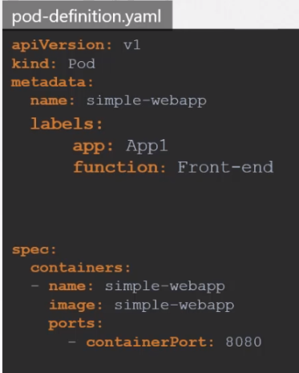
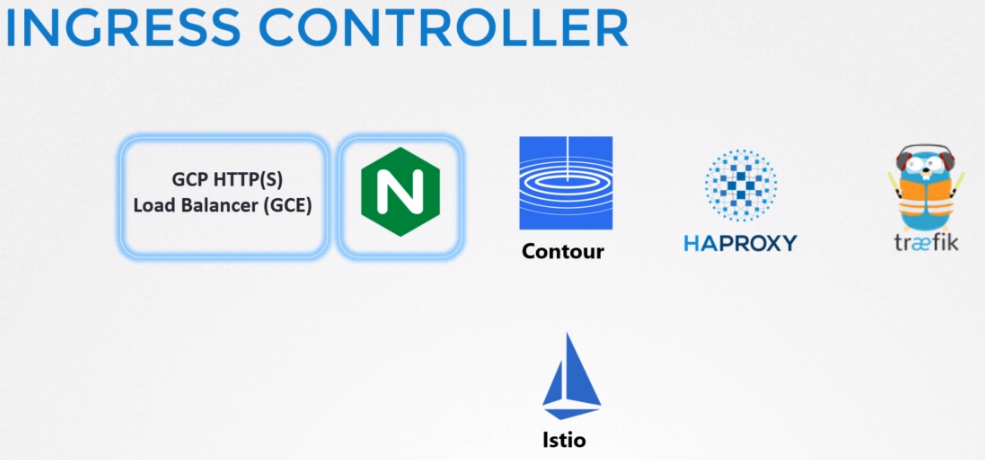
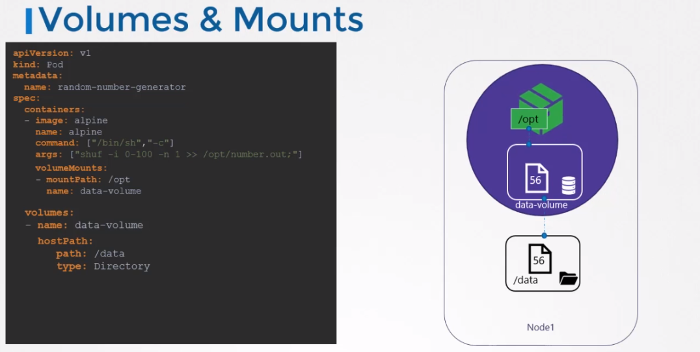

When we install kubernetes on a system we actually installing following components.

* Api Server -> acts as frontend to the Kubernetes. The users, management, devices, CLI, all talk within the Api Server interact
with Kubernetes cluster.
* Scheduler -> Distributes the work on the containers across multiple nodes.
* etcd -> Distributed key value store to manage the cluster
* kubelet -> The agent runs on each node in the cluster. Making sure that the containers are running on the nodes as expected.
* Controller -> Brain behind the cluster. Responsible for noticing and responding when nodes, container goes down.
Make decisions to bring up new containers
* Container Runtime -> Underlying software that is used to run containers. It can be Docker, rkt, cri-o

Kubelet and container runtime are located in worker nodes the others ; scheduler, etcd, controller, api server are located in master nodes.

kubectl -> kube control is the command line tool. It is used to deploy and manage applications on a cluster.

# Kubernetes Concepts
## PODS
Containers are encapsulated into an object PODs. A POD is a single instance of an application.
<br>
It is the smallest object we can create in kubernetes.
<br>
Whenever the load is increasing we create another POD not another container in a POD. 
POD have one-to-one relationship with the container. But we can create multiple container within a POD.
<br>
Sometimes it can make sense, for ex: a helper container maybe for some reason it needs to be able to communicate
within the container where they live in one POD.

Example POD definition file

```
apiVersion: v1
kind: Pod
metadata:
  name: postgres
  labels:
    tier: db-tier
spec:
  containers:
    - name: postgres
      image: postgres
      env:
        - name: POSTGRES_PASSWORD
          value: mysecretpassword
```

## YAML
Lets look at a little bit about YAML file.

Key-Value Pair
```
Fruit: Apple
Vegetable: Carrot
Meat: Chicken
```

Arrays/Lists
```
Fruits:
-   Orange
-   Apple
-   Banana
```
Dictionary/Map
```
Banana:
    Calories: 105
    Fat: 0.04g
    Carbs: 27 g
```

List are ordere, but Dictionary is not.

## Concepts in Depth
Kubernetes has yaml files to manage components.
<br>
All yaml files includes those 4 top level properties.
```
apiVersion:
kind:
metadata:
spec:
```

apiVersion can have the following values for spesific compoenents:
Kind | Version
--- | --- |
POD | v1 | 283 |
Service | v1 | 283 |
ReplicaSet | apps/v1 | 283 |
Deployment | apps/v1 | 283 |

apiVersion : This is the version of the Kubernetes API you're using to create the objects.
<br>
kind : Refers to the type of object we are trying to create. For ex: POD, service, replicaset, deployment
<br>
metadata: Information about the object like its name, labels etc. This is form of a dictionary.
<br>
spec: Additonal information field. For ex: containers

## Replication Controller
* It ensures that specified number of PODs are running at all times. It provides HA.
* Another thing that it provides us is to create multiple PODs to share the load. Load Balancing and Scaling
* Replication Controller and Replica Set can be comparable. They do same purposes but Replication Controller is legacy 
and recommended to use Replica Set.
* There is a difference when defining a sample yaml file for both of them which is labels and selectors. This option is 
available in replica set. We just label PODs that we create and in the selector section provide this label name.
This way replica set know which PODs to monitor.

Example ReplicaSet File
```
apiVersion: apps/v1
kind: ReplicaSet
metadata:
  name: frontend
  labels:
    app: mywebsite
    tier: frontend
spec:
  replicas: 4
  template:
    metadata:
      name: myapp-POD
      labels:
        app: myapp
    spec:
      containers:
        - name: nginx
          image: nginx
  selector:
    matchLabels:
      app: myapp
```
### Labels and Selectors
Replication Controller monitors the PODs to decide its desired actions.
There are lots of PODs exist in the cluster so how Replication Controller understands
the which PODs to monitor?
<br>
This is where Labels and Selectors come to the rescue.
When defining a POD definition, we use label and then use this label in the Replication Controller
definition file. This is the same behaviour almost in all other objects in Kubernetes.
<br>
Here is an example:

pod-definition.yml
```
metadata:
  name: myapp-pod
  labels:
    tier: front-end
```

replicaset-definition.yml
```
selector:
  matchLabels:
    tier: front-end
```


## Deployments
* Provides deployment features like rolling updates.
* When we create a deployment, it creates replicaset and then replicaset creates PODs.

Example Deployment File, similar with ReplicaSet except kind field.

```
apiVersion: apps/v1
kind: Deployment
metadata:
  name: frontend
  labels:
    app: mywebsite
    tier: frontend
spec:
  replicas: 4
  template:
    metadata:
      name: myapp-POD
      labels:
        app: myapp
    spec:
      containers:
        - name: nginx
          image: nginx
  selector:
    matchLabels:
      app: myapp
```

### Rollout
When you first create a deployment, it triggers a rollout. A new rollout create a new deployment revision like revision1.
<br>
In the future when a container upgraded, a new rollout is triggered and a new deployment revision is created like revision2.
<br>
This helps us keep track of the changes made to our deployment and enables us to roll back to a previous revision.

#### Deployment Strategies
There are two types of strategies.
* The first one is to remove all PODs and create new ones. This strategy is called Recreate and it's not the default strategy.
* The second one is to remove one PODs then creates new one one by one. This is called Rolling Update. This is the default strategy.

* Under the hood, when we upgrade a newer version, Kubernetes creates a new ReplicaSet, creates one POD in new ReplicaSet
remove one POD in previous ReplicaSet. This way all the PODs are created in new ReplicaSet.
* When you want to rollback the rollout the opposite way of this arhchitecture work.

## Networking
* Ip address is assigned to a POD unlike docker. Docker assigned ip address to a container.
When Kubernetes initialized in a system, it creates a private internal network with the ip address 10.24.0.0.
When new PODs are created, they get assigned an ip address from this network. PODs can communicate each other through this ip.

When you first initialize a cluster, all the nodes creates this private internal network in their own.
But the problem is when you communicate PODs from one node to another node, then it is possible to have IP conflict.
<br>
Kubernetes doesn't provide a solution to solve this problem when you first initialize the cluster.
It expects from us to make it correct way.
<br>
The rules we need to follow:
* All containers/PODs can communicate to one another without NAT.
* All nodes can communicate with all containers and vice-versa without NAT.
It is our responsibility to setup the network in the correct way.

But there are some products to handle this problem like Cisco FCI, Vmware NSX, flannel, cilium.

## Services
Helps us to connect applications together with other applications or users.
For ex; front-end PODs to backend-PODs or users to front-end PODs.
Enables loose coupling between microservices in our application.

<br>
These are the services types:
* NodePort : Service objects listen to request coming to node in your cluster and then forward this request to the related POD.
* ClusterIp : Service objects create a virtual IP inside the cluster to enable communication between different services.
* Load Balancer : Provisions a load balancer for our application in supported cloud providers.
<br>

### Node Port

There are 3 ports exist.
* First port in the image are called Target Port. This is exposed in the POD.
* Second port in the image are called Port. It forward request from Service to POD. Service object is like a virtual server inside
the node. Inside the cluster it has its own ip address and that ip address is called the cluster ip of the service.
* Third port in the image are called Node Port. This for accessing the web server externally. Node ports can only 
be in a valid range which by default is from 30000 to 32767.

### Cluster IP
As you know, PODs may go down and go up. So, in order to communicate PODs we need to define dynamic ip.
Cluster IP, provides a single interface for related PODs. 



### Load Balancer
When we want users to interact with our applications we can use this type of Service object, to be able to
provide a single domain name. This service can be integrated with cloud providers.

## Namespaces
It is logical place where we keep resources. For ex: deployments, replicasets, pods
We can create namespaces for different environments for ex.
Kubernetes creates a namespace by default for its internal configurations.

For ex: if we create a pod
```
kubectl create -f pod-definition.yml
```
it exists under the default namespace.
To be able to create it under another namespaces, simply use
```
kubectl create -f pod-definition.yml --namespace=dev
```
Or simply use namespace in yml file under metadata section.

* Creating namespace
```
kubectl create namespace dev
```
or with a yml file.

The contents of the file is:
```
apiVersion: v1
kind: Namespace
metadata:
  name: dev
```

# Configuration
## ConfigMaps
We can define configs in yaml file. But ConfigMap allows us to define configs in one place.
We first define ConfigMaps then inject it into PODs.
### Definition
There are two ways to define ConfigMap.
* Imperative way
```
kubectl create configmap
  <config-name> --from-literal=<key>=<value>
```
For ex:
Creates a config for 
APP_COLOR:blue 
APP_MODE: prod

```
kubectl create configmap \
  app-config --from-literal=APP_COLOR=blue \
             --from-literal=APP_MODE=prod
```
OR FROM A FILE
```
kubectl create configmap
  <config-name>  --from-file=<path-to-file>
```
For ex:
```
kubectl create configmap \
  app-config --from-file=app_config.properties
```

* Declarative way
```
kubectl create -f config-map.yaml
```
config-map.yaml
```
apiVersion: v1
kind: ConfigMap
metadata:
  name: app-config
data:
  APP_COLOR: blue
  APP_MODE: prod
```

* View ConfigMaps
```
kubectl get configmaps
```
* Details
```
kubectl describe configmaps
```
### Injection
Under the spec section we simply create new tags.
This way we load all configs
```
envFrom:
  - configMapRef:
      name: app-config  // name of the configmap
```
Injecting only one config
```
env:
  - name: APP_COLOR
    valueFrom:
      configMapKeyRef:
        name: app-config
        key: APP_COLOR
```

## Secrets
Similar to ConfigMaps, useful for sensitive data. For ex: storing db host, db user, db password.
First create a secret then inject into pod definition.
* Imperative way
```
kubectl create secret generic
  <secret-name> --from-literal=<key>=<value>
```

```
kubectl create secret generic \
  app-secret --from-literal=APP_COLOR=blue \
             --from-literal=APP_MODE=prod
```
OR FROM A FILE
```
kubectl create secret generic
  <secret-name>  --from-file=<path-to-file>
```
* Declarative way
```
kubectl create -f secret-data.yaml
```
secret-data.yaml
```
apiVersion: v1
kind: Secret
metadata:
  name: app-secret
data:
  DB_HOST: mysql
  DB_Password: pass
```

* View ConfigMaps
```
kubectl get secrets
```
* Details
```
kubectl describe secrets
```
### Injection
Under the spec section we simply create new tags.
For ex:
```
envFrom:
  - secretRef:
      name: app-secret  // name of the secret
```

## Service Account
There are two types of account in Kubernetes. User and Service
User accounts used by admin or developers
Service accounts used by services like Prometheus, Jenkins

Creating an account
```
kubectl create service account <name>
```
```
kubectl get serviceaccount
```
* When a service account created a Token assigned to this service account.
This token will be use by the service to authenticate the Kubernetes.
This token stored as a Secret object.
To view the token assigned to the Service Account

```
kubectl describe secret <service-account-token-name>
```

## Resource Requirements
??? LAter on

## Taints and Tolerations
??? Later on

## Node Selectors
??? Later on

## Node Affinity
??? Later on

# MultiContainer PODs
There are multiple patterns.

There must be sometimes where multiple components need to work together.
For ex: a log agent can run with web server. They can share the same network and storage.



We can add the container image definition in the pod definition file.



## Design Patterns
* Sidecar pattern -> logging service example is known as sidecar pattern.

# Observability
## Readiness and Liveness Probes
A POD has a pod status and some conditions. The POD status tells us where the POD is in its lifecycle.
When a POD is first created it is in a pending state.
This is when the scheduler tries to figure out where to place the POD.
If the scheduler cannot find the node to place the POD, it remains in a pending state. To find out why it's stuck
in a pending state, run the kubectl describe pod command and it will tell you exactly why.
<br>
Once the POD scheduled, it goes into a container creating status where the images required for
the application are pulled and the container starts.
<br>
Once all the containers in a POD starts it goes into a running state where it continues to be until
the program completes successfully or is terminated.
<br>
You can see the PODs status in the output of the kubectl get pods command.
So remember at any point in time the pod status can only be one of these values and only gives us a
high level summary of a POD.
<br>
However at times you may want additional information. 
<br>
Conditions compliment complement PODs status.
It is an array of true or false values that tell us the state of a POD. When a POD is scheduled on
a node.
The PodScheduledCondition is set to true. When the POD is initialized, Its value is set to true.
We know that a POD has multiple containers when all the containers inthe POD are ready. The ContainerReady condition is set to True and finally the POD itself is considered to be ready. To see the state
of POD conditions,

Run the kubectl describe pod command and look for the conditions section.
You can also see the ready state of the pod in the output of the kubectl get pods command and
that is the condition we are interested in.
The ready conditions indicate that the application inside the pod is running and is ready to accept user traffic.
What does that really mean?
<br>
The containers could be running different kinds of applications in them.
It could be a simple script that performs the job.
It could be a database service or a large server server in front end users.
The script may take a few milliseconds to get ready.
The database service may take a few seconds to power up, some web servers could take several minutes
to warm up. If you try to run an instance of a Jenkins server you will notice that it takes about 10 to 15
seconds for the server to initialize before a user can access the web UI.
Even after the web UI is initialized it takes a few seconds for the server to warm up and be ready to
serve users. During this wait period,
If you look at the State of the pod it continues to indicate that the pod is ready which is not very
true.

So why is that happening and how does Kubernetes know whether the application inside the container
is actually running or not.

But before we get into that discussion why does it matter if the state is reported incorrectly.
Let's look at a simple scenario where you create a POD and expose it to external users using a service.
The service will route traffic to the POD immediately.
The service relies on the pods ready condition to route traffic. By default,
kubernetes assumes that as soon as the container is created it is ready to serve user traffic.
So it sets the value of the ready condition for each container to true.
But if the application within the container took longer to get ready the service is unaware of it and
sends traffic through as the container is already in a ready state causing users to hit a POD that
isn't yet running a live application.

What we need here is a way to tie the ready condition to the actual state of the application inside

the container.

As a developer of the application you know better what it means for the application to be ready. There

are different ways that you can define if an application inside a container is actually ready. You can

set up different kinds of tests or probes which is the appropriate term in case of a web application.

It could be even the API server is up and running.

So you could run it a HTTP test to see if the API server response. In case of a database, you may test

to see if a particular TCP socket is listening or you may simply execute a command within the container

to run a custom script that will exit successfully if the application is ready.

So how do you configure that test. In the POD definition file,

Add a new field called readiness probe and use the HTTP get option. Specify the port and the ready API.

Now when the container is created Kubernetes does not immediately set the ready condition on the container

to true.

Instead it performs a test to see if the API responds positively.

Until then the service does not forward any traffic to the pod as it sees that the pod is not ready.

There are different ways a probe can be configured. For a http use httpGet option with the path and

the port. For TCP use the tcpSocket option with the port and for executing a command specify the exec

option with the command and options in an array format.

There are some additional options as well. If you know that your application will take a minimum of say

10 seconds to warm up,

you can add an additional delay to the probe. If you would like to specify how often to probe,

you can do that using the period seconds option. By default, if the application is not ready after three

attempts,

the probe will stop. If you would like to make more attempts use the failure threshold option.

We will look through more options in the documentation walkthrough.

Finally let us look at how readiness probes are useful in a multi pod setup.

Say you have a replica set or deployment with multiple pods and a service serving traffic to all the

pods.

There are two PODs already serving users say you want to add an additional pod and let's say the pod

takes a minute to warm up. Without the readiness probe configured correctly,

the service would immediately start routing traffic to the new POD. That will result in service disruption

to at least some of the users.

Instead, if the PODs were configured with the correct readiness probe, the service will continue to serve

traffic only to the older PODs and wait until the new POD is ready.

Once ready the traffic will be routed to the new POD as well, ensuring no users are affected.

Well that's it for this lecture head over and practice what you learned in the coding exercise section.





## Liveness Probes
Think of a scenario where we run doker run nginx and the application doesn't start for some reason.
If you run the same command with kubernetes will try to restart app at every attempt.
What if the application is not working but containers stay alive? Kubernetes thinks that
app is alive. This is where liveness probe helps us.
It basically checks the container in a time interval to understand app is healthy.


## Container Logging
To see the logs in docker
```
docker logs -f ecf
```
in Kubernetes
```
kubectl logs -f <pod-file.yaml>
```

But a POD can have multiple containers. To be able to see the specific container logs
we need to explicitly define container id in command.

```
kubectl logs -f <pod-file.yaml> <container-name>
```
## Monitor and Debug Application
There are some monitoring tools like
Metrics Server, Prometheus, Elastic Stack, DataDog and Dynatrace.
<br>
Metrics Server stores data in memory so we can not look for historical data.
Remember kubelet is an agent runs on PODs. Kubelet sends data to external sources.

# POD Design
## Labels, Selector
In Kubernetes we have lots of objects. Over the time we may need a situation for categorizing and filtering objects.
Labels are the way we group items together. For ex: grouping by color. PODs, ReplicaSets etc.
We can group by application type, or functionality. For ex: Front-End, Back-end, Cache, Db
Selectors are the way we filter the labels. 


Defining labels
<br>


Once the POD created use the command to filter
```
kubectl get pods --selector app=App1
```

## Rolling Updates and Rolbacks
```
kubectl rollout status deployment/<my-deployment>

kubectl rollout history deployment/<my-deployment>

kubectl rollout undo deployment/<mp-deployment>
```

## Jobs


## Services

### Ingres Networking
Built in load balancer lives with Kubernetes.


Nginx is supported by Kubernetes. We simply deploy an Nginx Deployment 

### Network Policies
Allow rules based for POD. It is like security group in AWS

# State Persistence
In docker, the data live within the container. If the containes dies then the data live within also.
To persist data we use volumes. Its same in the Kubernetes.


We can use storage solutions to work with Kubernetes. For ex: AWS EBS
This way volume storage will now be located in AWS.

## Persistent Volumes


## Storage Classes