## Command and Arguments
How can we specify docker commands in Kubernetes?
> We pass parameters to as args in pod definition file

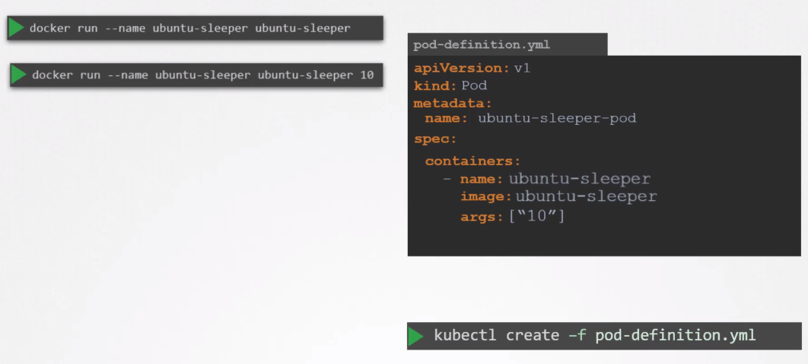

We specify entrypoint and cmd in kubernetes like this
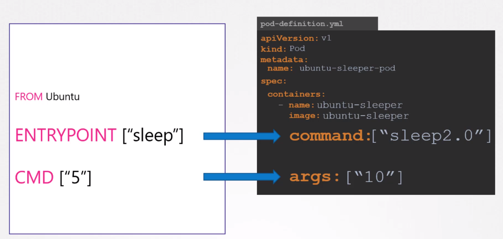

### Environment Variables

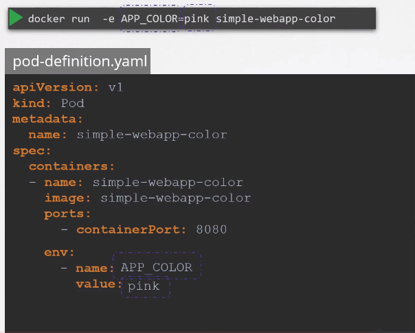

There are another ways of define env. variables using ConfigMap and Secret.Overall all these types:

```
env: 
  - name: APP_COLOR
    value: pink
```
```
env: 
  - name: APP_COLOR
    valueFrom:
      configMapKeyRef:
```
```
env: 
  - name: APP_COLOR
    valueFrom:
      secretKeyRef:
```

## ConfigMaps
Using lots of parameters in definition file creates complexity. We separate this.
<br>
Steps to build configmap

- Create
- Inject into pod

We can define configs in yaml file. But ConfigMap allows us to define configs in one place.
We first define ConfigMaps then inject it into PODs.
### Definition
There are two ways to define ConfigMap.
* Imperative way
```
kubectl create configmap
  <config-name> --from-literal=<key>=<value>
```
For ex:
Creates a config for 
APP_COLOR:blue 
APP_MODE: prod

```
kubectl create configmap \
  app-config --from-literal=APP_COLOR=blue \
             --from-literal=APP_MODE=prod
```
OR FROM A FILE
```
kubectl create configmap
  <config-name>  --from-file=<path-to-file>
```
For ex:
```
kubectl create configmap \
  app-config --from-file=app_config.properties
```

* Declarative way
```
kubectl create -f config-map.yaml
```
config-map.yaml
```
apiVersion: v1
kind: ConfigMap
metadata:
  name: app-config
data:
  APP_COLOR: blue
  APP_MODE: prod
```

* View ConfigMaps
```
kubectl get configmaps
```
* Details
```
kubectl describe configmaps
```

## Secrets
Similar to ConfigMaps, useful for sensitive data. For ex: storing db host, db user, db password. <br>
Similar to configmap except stored encoded or hashed format.
First create a secret then inject into pod definition.
* Imperative way
```
kubectl create secret generic
  <secret-name> --from-literal=<key>=<value>
```

```
kubectl create secret generic \
  app-secret --from-literal=APP_COLOR=blue \
             --from-literal=APP_MODE=prod
```
OR FROM A FILE
```
kubectl create secret generic
  <secret-name>  --from-file=<path-to-file>
```
* Declarative way
```
kubectl create -f secret-data.yaml
```
secret-data.yaml
```
apiVersion: v1
kind: Secret
metadata:
  name: app-secret
data:
  DB_HOST: mysql
  DB_Password: pass
```

* View ConfigMaps
```
kubectl get secrets
```
* Details
```
kubectl describe secrets
```
## SecurityContexts
### Docker Security
We need to first look at docker security. In docker the host and container processes share the same kernel, but they run
on different namespaces. The namespaces is the place where the process isolated from themselves.

<p>
Docker root user and host root user capabilities can be different. We can restrict docker root user capabilities with some commands.

<p>
We can configure to apply security settings at the pod level or container level in K8s. If we apply at the pod level
then the all containers live in the pod will be apply this settings. The security settings at the container
level will override the pod level settings.

Pod level settings
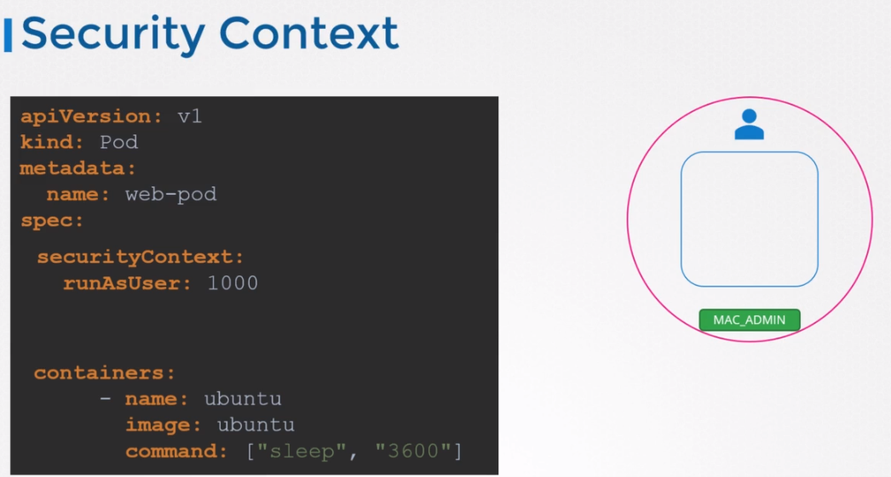

Container level settings
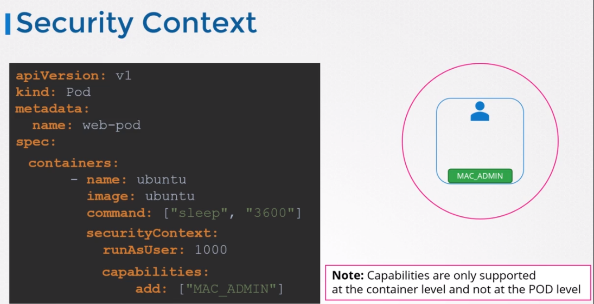

## ServiceAccounts
Service accounts link to security related things such as authentication, authorization, role based access control and etc.
<br>
There are two types of account in Kubernetes. User and Service
User accounts used by admin or developers
Service accounts used by services like Prometheus, Jenkins
<br>
Think that you create a dashboard that shows pods live in K8s, for that you interact with the api server
live in K8s cluster. So, in order your application can talk with K8s it has to be
authenticated, for this we create service accounts.

Creating an account
```
kubectl create serviceaccount <name>
```
```
kubectl get serviceaccount
```
* When a service account created a Token assigned to this service account.
This token will be use by the service to authenticate the Kubernetes.
This token stored as a Secret object.
To view the token assigned to the Service Account

```
kubectl describe secret <service-account-token-name>
```


## Resource Requirements

A pod consumes cpu, mem, disk on the node. The scheduler decides which node a pod goes to.
<br>
The default is 0.5 cpu, and 256 mi memory. This is known as resource request.

> For the POD to pick up those defaults you must have first set those as default values for request and limit by creating a LimitRange in that namespace.

Something like this
```
apiVersion: v1
kind: LimitRange
metadata:
  name: mem-limit-range
spec:
  limits:
  - default:
      memory: 512Mi
    defaultRequest:
      memory: 256Mi
    type: Container
```

We can specify resources in pod definition file.
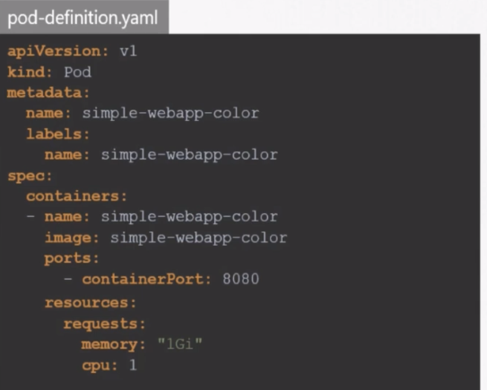

In this file we requested 1 count of CPU. What does it mean?
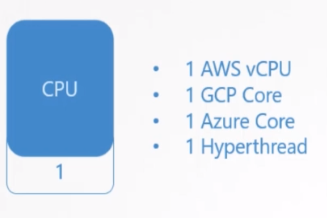
1 count of cpu equvailent to this.

We can also define gigabyte or gibibyte for memory
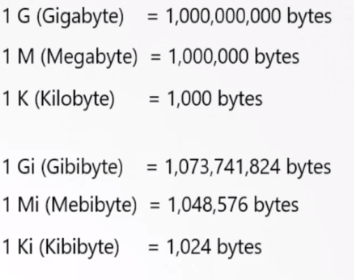

1 kb = 1000 bytes
1 ki = 1024 bytes

<p>
There is no limit for running pod in K8s. But we can define limit.
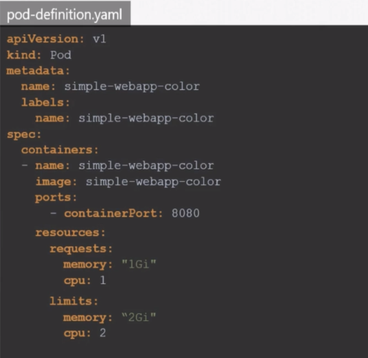

This is gonna apply for all containers live in pod.
<p>

What happens if pod out of cpu or memory?
> It can not go beyond the cpu, but can go for memory. In this case pod will terminated

## Taints and Tolerations
Its nothing to do with security. Its used to set restrictions on what pods can be scheduled on a node.
<br>
By default there are no restrictions to place a pod in nodes. The schedulers place pods in nodes
<br>
It is possible that we may have a node for spesific resources that can be run for some pod.
<br>
We use taint at the node level, and use tolerations for pod.

## Node Selectors
Assume that we have a set of nodes but some of them are large and we want to move data processing pods to
that large nodes. That is where we use node selectors. We just add a definition in pod file.
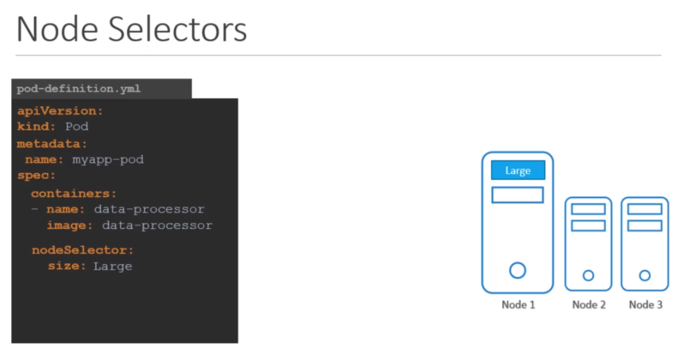

But wait, how we know the big node is labeled with 'Large' key?
<br>
We can label node like this.

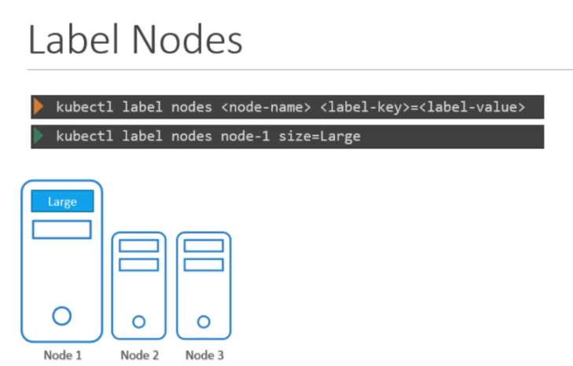

The drawback of node selector is that when we want to apply some complex logic like place pods
on the nodes which are not medium or small?

## Node Affinity
To overcome this problem we use node affinity. We can define custom expression like or, not

## Taints and Tolerations vs Node Affinity
There are some cases we need to use both.