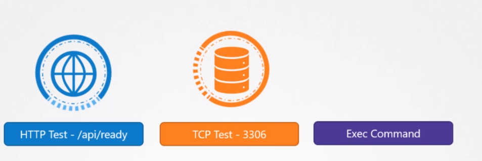
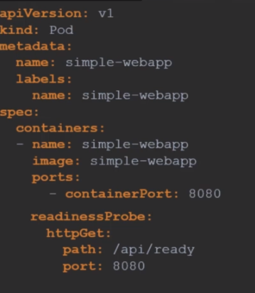
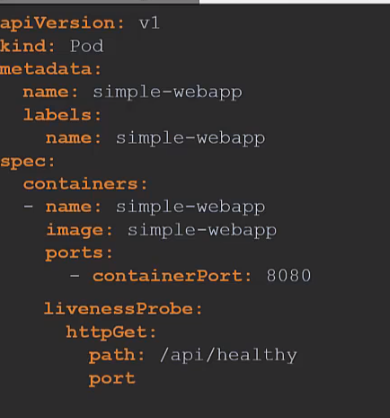

## Readiness and Liveness Probes
A POD has a pod status and some conditions. The POD status tells us where the POD is in its lifecycle.
When a POD is first created it is in a pending state.
This is when the scheduler tries to figure out where to place the POD.
If the scheduler cannot find the node to place the POD, it remains in a pending state. To find out why it's stuck
in a pending state, run the kubectl describe pod command and it will tell you exactly why.
<br>
Once the POD scheduled, it goes into a container creating status where the images required for
the application are pulled and the container starts.
<br>
Once all the containers in a POD starts it goes into a running state where it continues to be until
the program completes successfully or is terminated.
<br>
You can see the PODs status in the output of the kubectl get pods command.
So remember at any point in time the pod status can only be one of these values and only gives us a
high level summary of a POD.
<br>
However at times you may want additional information. 
<br>
Conditions compliment complement PODs status.
It is an array of true or false values that tell us the state of a POD. When a POD is scheduled on
a node.
The PodScheduledCondition is set to true. When the POD is initialized, Its value is set to true.
We know that a POD has multiple containers when all the containers inthe POD are ready. The ContainerReady condition is set to True and finally the POD itself is considered to be ready. To see the state
of POD conditions,

Run the kubectl describe pod command and look for the conditions section.
You can also see the ready state of the pod in the output of the kubectl get pods command and
that is the condition we are interested in.
The ready conditions indicate that the application inside the pod is running and is ready to accept user traffic.
What does that really mean?
<br>
The containers could be running different kinds of applications in them.
It could be a simple script that performs the job.
It could be a database service or a large server server in front end users.
The script may take a few milliseconds to get ready.
The database service may take a few seconds to power up, some web servers could take several minutes
to warm up. If you try to run an instance of a Jenkins server you will notice that it takes about 10 to 15
seconds for the server to initialize before a user can access the web UI.
Even after the web UI is initialized it takes a few seconds for the server to warm up and be ready to
serve users. During this wait period,
If you look at the State of the pod it continues to indicate that the pod is ready which is not very
true.

So why is that happening and how does Kubernetes know whether the application inside the container
is actually running or not.

But before we get into that discussion why does it matter if the state is reported incorrectly.
Let's look at a simple scenario where you create a POD and expose it to external users using a service.
The service will route traffic to the POD immediately.
The service relies on the pods ready condition to route traffic. By default,
kubernetes assumes that as soon as the container is created it is ready to serve user traffic.
So it sets the value of the ready condition for each container to true.
But if the application within the container took longer to get ready the service is unaware of it and
sends traffic through as the container is already in a ready state causing users to hit a POD that
isn't yet running a live application.

What we need here is a way to tie the ready condition to the actual state of the application inside

the container.

As a developer of the application you know better what it means for the application to be ready. There

are different ways that you can define if an application inside a container is actually ready. You can

set up different kinds of tests or probes which is the appropriate term in case of a web application.

It could be even the API server is up and running.

So you could run it a HTTP test to see if the API server response. In case of a database, you may test

to see if a particular TCP socket is listening or you may simply execute a command within the container

to run a custom script that will exit successfully if the application is ready.

So how do you configure that test. In the POD definition file,

Add a new field called readiness probe and use the HTTP get option. Specify the port and the ready API.

Now when the container is created Kubernetes does not immediately set the ready condition on the container

to true.

Instead it performs a test to see if the API responds positively.

Until then the service does not forward any traffic to the pod as it sees that the pod is not ready.

There are different ways a probe can be configured. For a http use httpGet option with the path and

the port. For TCP use the tcpSocket option with the port and for executing a command specify the exec

option with the command and options in an array format.

There are some additional options as well. If you know that your application will take a minimum of say

10 seconds to warm up,

you can add an additional delay to the probe. If you would like to specify how often to probe,

you can do that using the period seconds option. By default, if the application is not ready after three

attempts,

the probe will stop. If you would like to make more attempts use the failure threshold option.

We will look through more options in the documentation walkthrough.

Finally let us look at how readiness probes are useful in a multi pod setup.

Say you have a replica set or deployment with multiple pods and a service serving traffic to all the

pods.

There are two PODs already serving users say you want to add an additional pod and let's say the pod

takes a minute to warm up. Without the readiness probe configured correctly,

the service would immediately start routing traffic to the new POD. That will result in service disruption

to at least some of the users.

Instead, if the PODs were configured with the correct readiness probe, the service will continue to serve

traffic only to the older PODs and wait until the new POD is ready.

Once ready the traffic will be routed to the new POD as well, ensuring no users are affected.

Well that's it for this lecture head over and practice what you learned in the coding exercise section.





## Liveness Probes
Think of a scenario where we run doker run nginx and the application doesn't start for some reason.
If you run the same command with kubernetes will try to restart app at every attempt.
What if the application is not working but containers stay alive? Kubernetes thinks that
app is alive. This is where liveness probe helps us.
It basically checks the container in a time interval to understand app is healthy.



## Container Logging
To see the logs in docker
```
docker logs -f ecf
```
in Kubernetes
```
kubectl logs -f <pod-file.yaml>
```

But a POD can have multiple containers. To be able to see the specific container logs
we need to explicitly define container id in command.

```
kubectl logs -f <pod-file.yaml> <container-name>
```
## Monitor and Debug Application
There are some monitoring tools like
Metrics Server, Prometheus, Elastic Stack, DataDog and Dynatrace.
<br>
Metrics Server stores data in memory so we can not look for historical data.
Remember kubelet is an agent runs on PODs. Kubelet sends data to external sources.