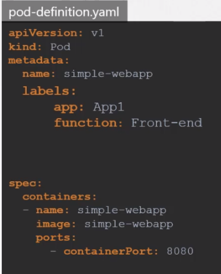

## Labels, Selector
In Kubernetes we have lots of objects. Over the time we may need a situation for categorizing and filtering objects.
Labels are the way we group items together. For ex: grouping by color. PODs, ReplicaSets etc.
We can group by application type, or functionality. For ex: Front-End, Back-end, Cache, Db

- Labels are the way we grouped items together
- Selectors are the way we filter the labels. 
- There is also another type called annotations. Useful for other details like tool details, buildVersion, phone, email etc


Defining labels
<br>


Once the POD created use the command to filter
```
kubectl get pods --selector app=App1
```

## Rolling Updates and Rolbacks
```
kubectl rollout status deployment/<my-deployment>

kubectl rollout history deployment/<my-deployment>

kubectl rollout undo deployment/<mp-deployment>
```

## Jobs
If you run a command in docker container, it starts the container, executes the job and terminates the container. <br>
But in K8s the container works forever, because it is designed like that. So, in order to override this feature
we use restartPolicy: Never in pod definition file. 

<p>

We can create job using pod definition file. And we can see the output using log command


We can create multiple pods to be able to finish the job.
In this case the pods created one after the another.


If we want to run pods parallel, then do like this.


## Cron Jobs
A job that can be scheduled.

