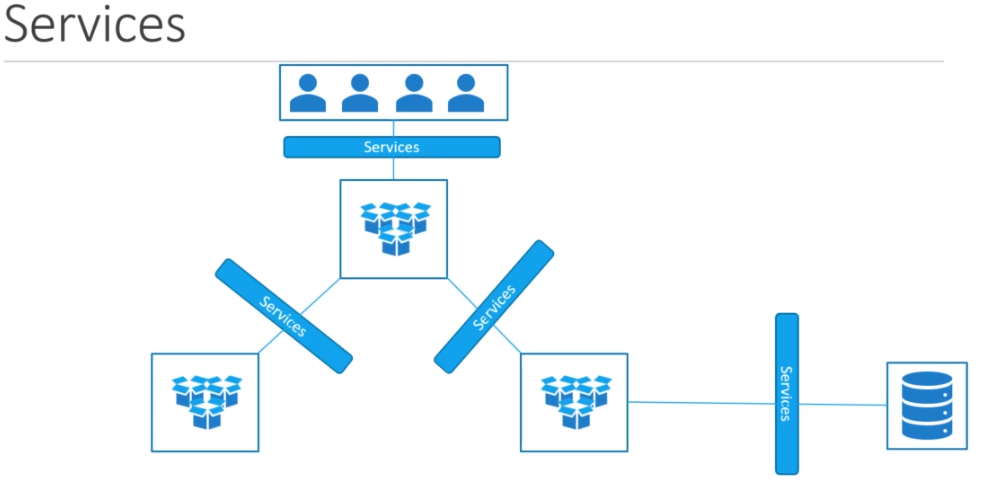
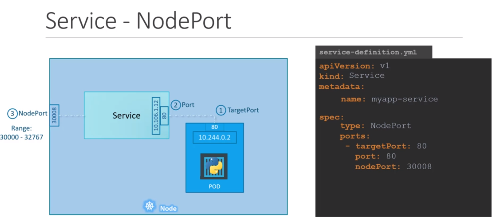
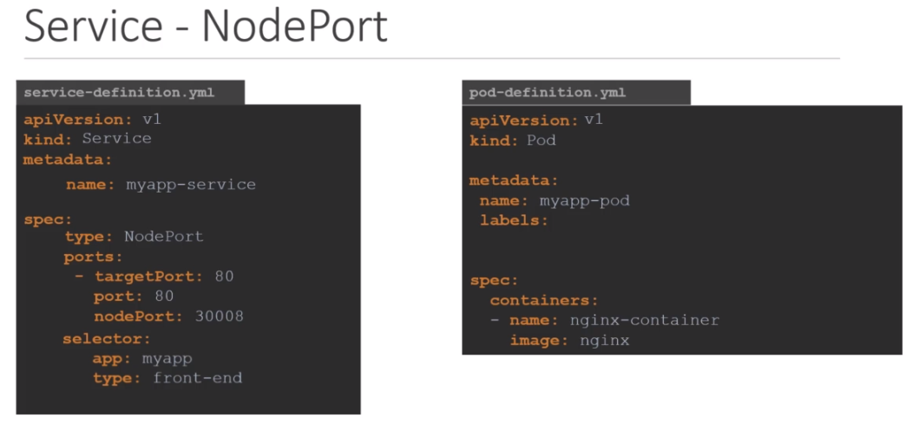
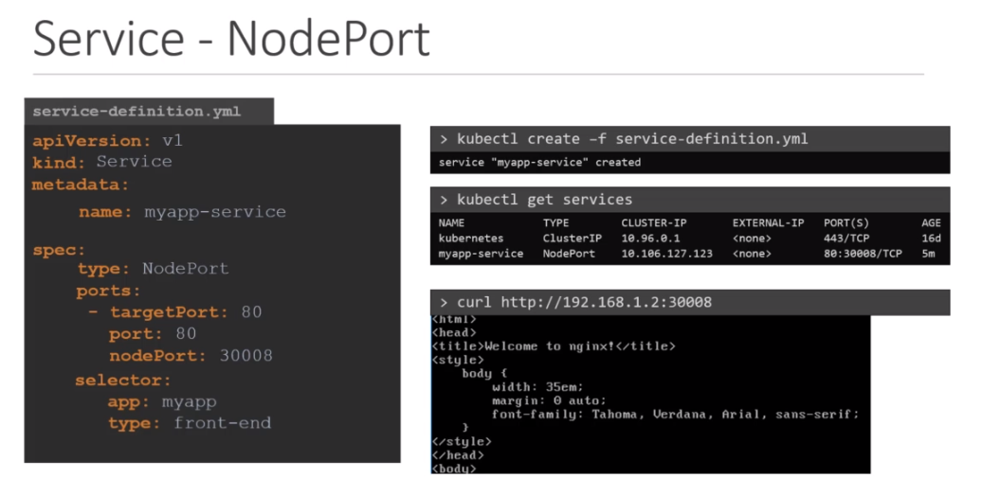
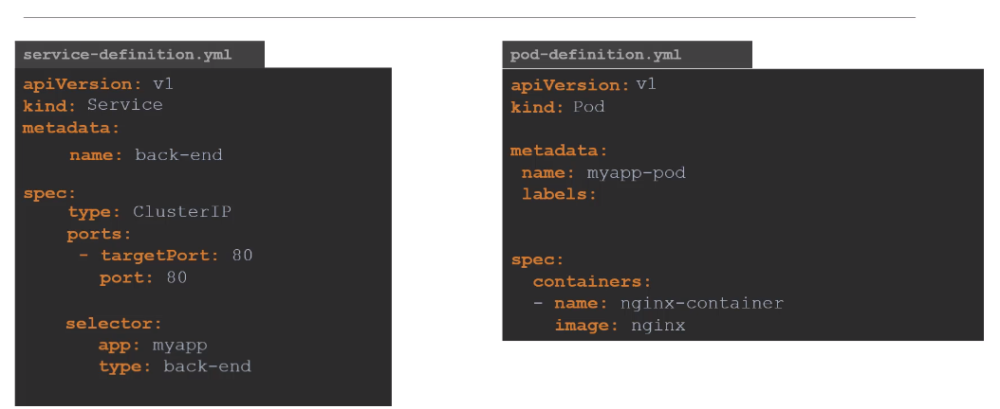

- Enable communications between various objects in and out of K8s.
- Helps us connect applications 
- Enables loose coupling microservices in application

Helps us to connect applications together with other applications or users.
For ex; front-end PODs to backend-PODs or users to front-end PODs.
Enables loose coupling between microservices in our application.

 
These are the services types:

* NodePort : Service objects listen to request coming to node in your cluster and then forward this request to the related POD.
* ClusterIp : Service objects create a virtual IP inside the cluster to enable communication between different services.
* Load Balancer : Provisions a load balancer for our application in supported cloud providers.
 

## Node Port

There are 3 ports exist.
* First port in the image are called Target Port. This is exposed in the POD.
* Second port in the image are called Port. It forward request from Service to POD. Service object is like a virtual server inside
the node. Inside the cluster it has its own ip address and that ip address is called the cluster ip of the service.
* Third port in the image are called Node Port. This for accessing the web server externally. Node ports can only 
be in a valid range which by default is from 30000 to 32767.

Link pod with services.

We can now access the web app by using curl.

## Cluster IP
As you know, PODs may go down and go up. So, in order to communicate PODs we need to define dynamic ip.
Cluster IP, provides a single interface for related PODs. 

Link pods with services

## Load Balancer
When we want users to interact with our applications we can use this type of Service object, to be able to
provide a single domain name. This service can be integrated with cloud providers.
