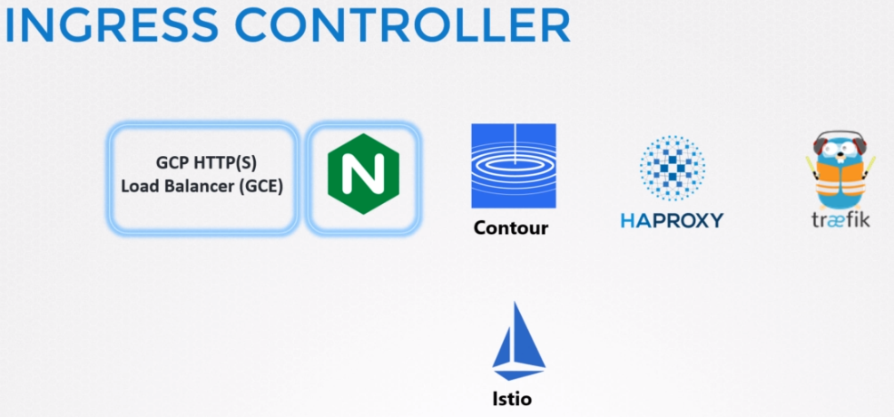
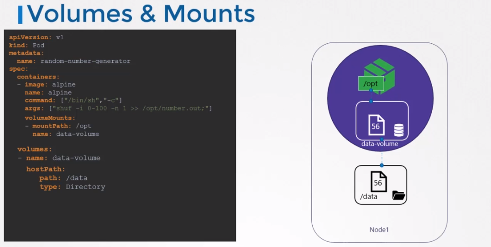

## Ingres Networking
Built in load balancer lives with Kubernetes.

Nginx is supported by Kubernetes. We simply deploy an Nginx Deployment 

### Network Policies
Allow rules based for POD. It is like security group in AWS

# State Persistence
In docker, the data live within the container. If the containes dies then the data live within also.
To persist data we use volumes. Its same in the Kubernetes.

We can use storage solutions to work with Kubernetes. For ex: AWS EBS
This way volume storage will now be located in AWS.
