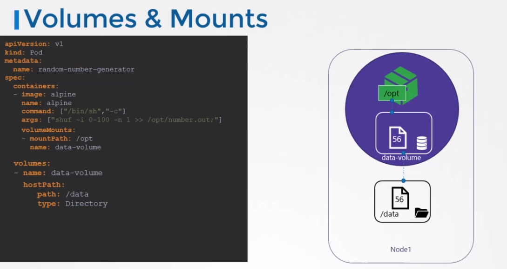
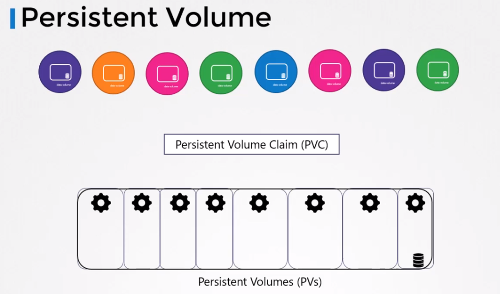
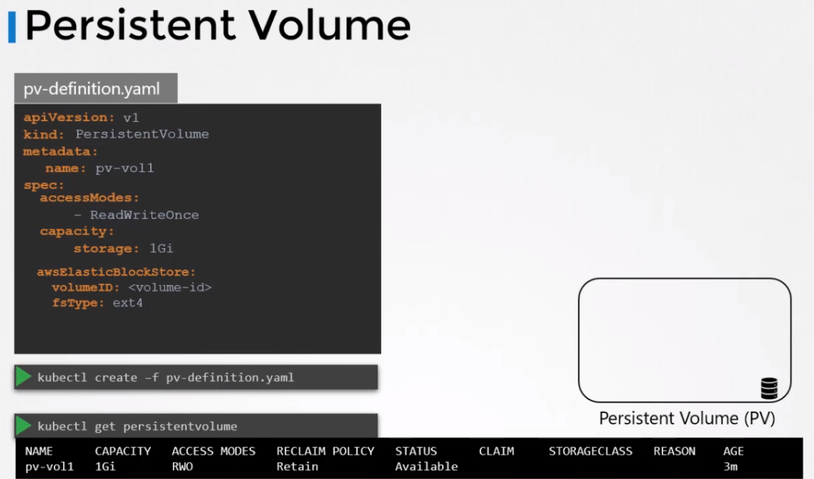
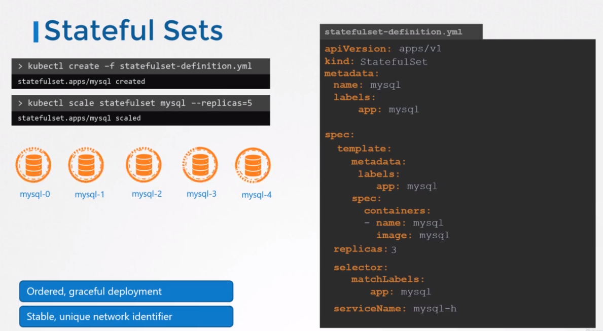
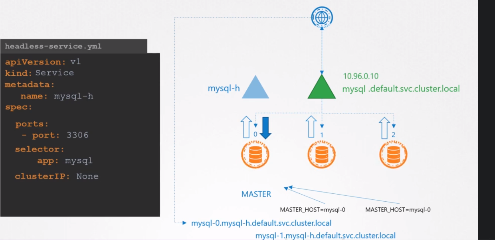
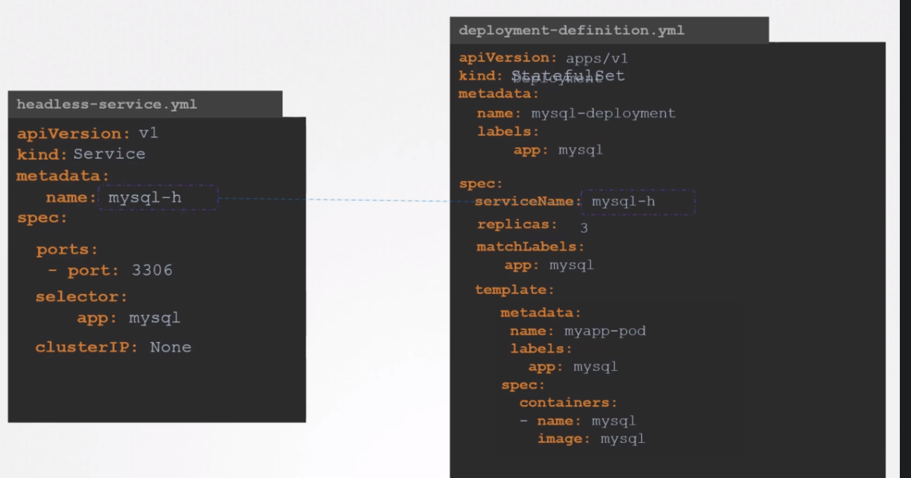
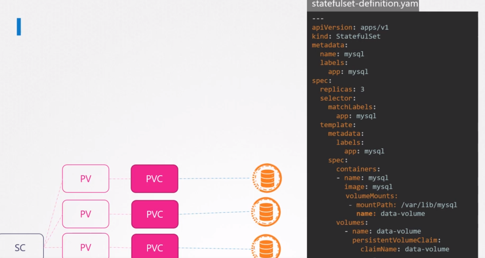
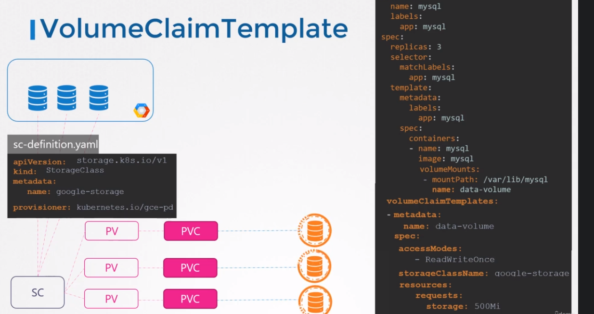

## Volumes
We can create volume to persist data on nodes. We can do this in pod definition file.
<br>
The important point here is replication. When we mount a volume to a node than
all the nodes have different data. This might not be the solution that we need.
<br>
We can use replication products like GlusterFS, Flocker, AWS EBS, GCP etc.



## Persistent Volumes
A centralized persistent volumes strategy for applications.
Because each time an application needs a volume, they need to configure and manage it by own.
Instead we create a centralized pool of volumes and when they need a volume,
pick from the pool.

<p>
A persistent volume is a cluster wide pool of storage volumes configured by an administrator to be used

by users deploying applications on the cluster.

The users can now select storage from this pool using Persistent Volume claims.



Creation of Persistent Volume


## Persistent Volume Claim
Persistent volume and Persistent volume claims are two separate objects in K8s namespaces.
- Administrator creates persistent volumes, users create pvc to use the storage.

Once pvc created, K8s binds the claims to the pv.
- Every Persistent Volume Claim is bound to a single

## Using PVCs in PODs
Once you create a PVC use it in a POD definition file by specifying the PVC Claim name under persistentVolumeClaim section in the volumes section like this:

```
apiVersion: v1
kind: Pod
metadata:
  name: mypod
spec:
  containers:
    - name: myfrontend
      image: nginx
      volumeMounts:
      - mountPath: "/var/www/html"
        name: mypd
  volumes:
    - name: mypd
      persistentVolumeClaim:
        claimName: myclaim
```
The same is true for ReplicaSets or Deployments. Add this to the pod template section of a Deployment on ReplicaSet.

## Storage Classes
Dynamic provisioning

## Stateful Sets
For ex you want to create a mysql cluster with one master and two slaves.
There are multiple steps to achieve that like create master, create slaves, copy data from master to slave etc.
<br>
If we do it with deployments in K8s there was some problems

- There is no guarantee in pod creation, So in this case its a problem because we need to create
master first
- We cant assign static ip or hostname in deployments. This is problem because slaves need to connect
master. Even we do that it is still problem because what happens when the master pod crashes.

This is where StatefulSet comes into play. Important features of it
- PODs are created in sequential order
- Each pods gets unique name. No more random names

We can create stateful sets just like deployments. They are very similar. 
- We need to define a headless service.
- Pods are scaled one after another same as deletion
- We can also override this behavior and still take advantage of other features of the statefulsets. We
can do this by adding parallel keyword in definition file. This way all the pods are created parallel.



## Headless Service
Think that we create mysql cluster. Web application needs to interact with that database throug services which is type of cluster ip. So, the problem here is that, how we route write request only master pod.
- We can do it by define static code in application points the master pod ip. But ip can change this is a problem
- We can do it by dns name. But dns name in K8s, prepended by ip address

What we need is a service that doesn't load balance the request but gives us a dns entry for each pod.
That is what a headless service is.

- A headless service is just like a normal service but it doesnt have an ip on its own like a cluster ip of a normal service.




## Storage in StatefulSets
By default in each pod in stateful sets share a common volume.
to be able to create a mount for very pod, we need to create pvc and pv.
<br>
We can achieve that using volume claim template.




We now have a stateful said with volume claim templates and a storage class definition with the right

provisions for GCE.

When the stateful said is created first, it creates the first part, and during the creation of the

pod, a Paepcke is created, the PVC is associated to a storage class.

So the storage class provisions of volume on GCP and then creates a PV and associates the PV with the

volume and binds the PVC to the PV.

Then the second part is created, the second part creates a privacy, then the storage class provisions,

a new volume, associates that to OPV and binds the Peevey to the PVC and so on for the third part.

What if one of these parts fail and is recreated or rescheduled onto a A. stateful said, do not automatically

delete the BBC or the associated volume to the part.

Instead, it ensures that the pod is reattached to the same privacy that it was attached to before the

stateful sets ensure stable storage for parts.